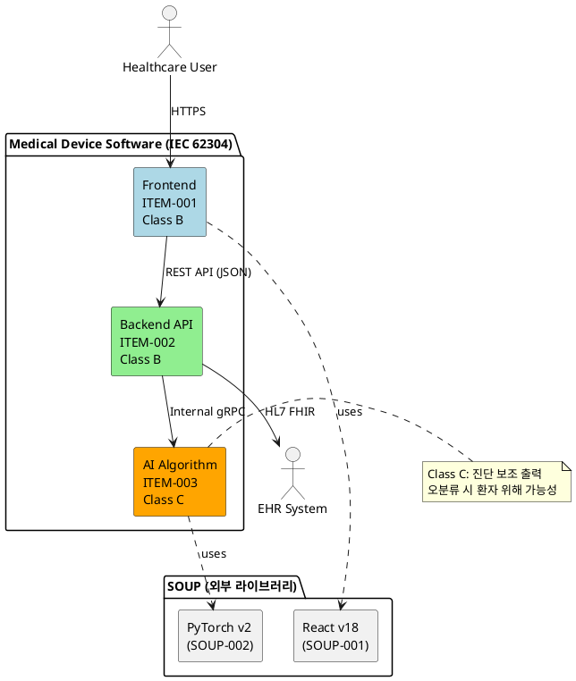
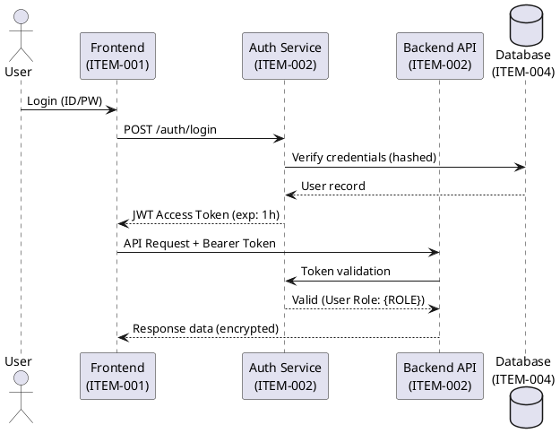
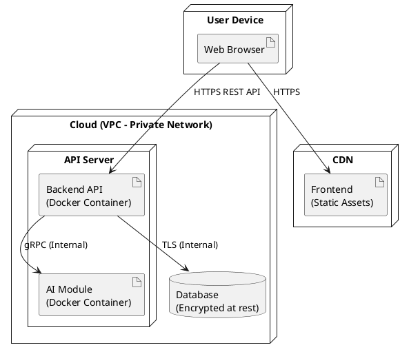

# Software Architecture Description (SAD): {PRODUCT_NAME}

<!-- AI AGENT 작성 지침
이 문서는 IEC 62304 Cl.5.3 기반 SW 아키텍처 설계서입니다.
작성 전 반드시 다음 문서를 참조하세요:
  - 시스템 요구사항 명세서(system-requirements-spec.md): 시스템 요구사항 및 안전등급 확인
  - SOUP 리스트(soup-list.md): 외부 라이브러리 목록 확인
  - 위험 관리 계획서(risk-management-plan.md): 위험 통제 관련 아키텍처 결정 반영

작성 지침:
1. 모든 SW 아이템은 고유 식별자를 부여하세요 (예: ITEM-001)
2. 안전 등급(Class A/B/C)을 아이템마다 명시하세요
3. SOUP는 반드시 격리 전략을 기술하세요 (IEC 62304 Cl.5.3.5)
4. 다이어그램은 아래 PlantUML 지침에 따라 작성하세요
5. 보안 아키텍처 섹션을 반드시 채워주세요 (MDR Annex I 17.2)

PlantUML 다이어그램 작성 지침:
- 컴포넌트 다이어그램: SW 아이템 간 관계 표현 -> 섹션 2.3에 작성
- 시퀀스 다이어그램: 주요 데이터 흐름 표현 -> 섹션 4에 작성
- 배포 다이어그램: 실행 환경 구성 표현 -> 섹션 5에 작성

PlantUML 문법 예시 (```plantuml ... ``` 블록 사용):
```
@startuml Component_Overview
package "Medical Device Software" {
  component [Frontend Module] as FE
  component [Backend Module] as BE
  component [AI Algorithm Module] as AI
}
FE --> BE : REST API
BE --> AI : Internal Call
@enduml
```
-->

**문서 번호**: {DOC_ID}
**버전**: {VERSION} | **상태**: Draft
**작성일**: {DATE} | **작성자**: {AUTHOR}
**검토자**: {REVIEWER} | **승인자**: {APPROVER}

---

## 표준 요건 매핑 (Standard Requirements Mapping)

| IEC 62304 조항     | 제목                         | 해당 섹션                  | Class |
| ------------------ | ---------------------------- | -------------------------- | ----- |
| Cl. 5.3.1          | SW 아키텍처 변환             | 2. SW 시스템 구조          | B, C  |
| Cl. 5.3.2          | SW 아이템 간 인터페이스 정의 | 3. 인터페이스 정의         | B, C  |
| Cl. 5.3.3          | 공개된 알려진 이상 식별      | 2. SW 시스템 구조          | B, C  |
| Cl. 5.3.4          | 추가 위험 평가 실시          | 6. 위험 관련 아키텍처 결정 | B, C  |
| Cl. 5.3.5          | SOUP 소프트웨어 아이템 격리  | 5. SOUP 격리 전략          | B, C  |
| Cl. 5.3.6          | 형상 항목 식별               | 7. 형상 항목 목록          | B, C  |
| MDR Annex II 3.(c) | 설계 및 제조 정보            | 전체                       | -     |
| MDR Annex I 17.2   | IT 보안 고려                 | 4. 보안 아키텍처           | -     |

---

## 1. 개요 (Overview)

### 1.1 목적

이 문서는 {PRODUCT_NAME}의 SW 아키텍처를 정의한다.
IEC 62304의 안전 등급 결정에 따라 SW 시스템을 아이템(Item) 단위로 분해하고, 아이템 간 인터페이스 및 SOUP 격리 전략을 명시한다.

### 1.2 연관 문서

| 문서명                 | 문서 ID         | 비고                 |
| ---------------------- | --------------- | -------------------- |
| 시스템 요구사항 명세서 | {SRS_DOC_ID}    | 아키텍처의 입력      |
| SW 요구사항 명세서     | {SRS_SW_DOC_ID} | 기능 요구사항 출처   |
| 위험 관리 계획서       | {RMP_DOC_ID}    | 위험 통제 조치 반영  |
| SOUP 리스트            | {SOUP_DOC_ID}   | 외부 라이브러리 목록 |

### 1.3 SW 안전 등급 요약

<!-- AI AGENT: 시스템 요구사항 명세서의 등급 분류 결과를 옮겨 기재하세요 -->

| SW 아이템     | IEC 62304 등급 | 근거        |
| ------------- | -------------- | ----------- |
| {ITEM_1_NAME} | Class {A/B/C}  | {RATIONALE} |
| {ITEM_2_NAME} | Class {A/B/C}  | {RATIONALE} |

---

## 2. SW 시스템 구조 (SW System Architecture)

> IEC 62304 Cl.5.3.1: SW 시스템을 SW 아이템으로 분해하고 각각의 기능, 인터페이스, 안전 등급을 정의해야 함

### 2.1 전체 구조 요약

<!-- AI AGENT: 제품의 주요 SW 아이템을 나열하고 각각의 역할을 간략히 기술하세요
예시:
- Frontend (ITEM-001): 사용자 인터페이스, 웹 브라우저 기반
- Backend API (ITEM-002): 비즈니스 로직 처리, REST API 제공
- AI/ML 추론 모듈 (ITEM-003): 진단 보조 알고리즘 실행
- 데이터베이스 (ITEM-004): 환자 데이터 영구 저장
-->

{ARCHITECTURE_SUMMARY}

### 2.2 SW 아이템 목록

| 아이템 ID | 아이템 명     | 기능 설명         | 안전 등급     | 기술 스택    | 배포 방식    |
| --------- | ------------- | ----------------- | ------------- | ------------ | ------------ |
| ITEM-001  | {ITEM_1_NAME} | {ITEM_1_FUNCTION} | Class {CLASS} | {TECH_STACK} | {DEPLOYMENT} |
| ITEM-002  | {ITEM_2_NAME} | {ITEM_2_FUNCTION} | Class {CLASS} | {TECH_STACK} | {DEPLOYMENT} |

### 2.3 컴포넌트 다이어그램

<!-- AI AGENT: 아래 PlantUML 블록 안에 SW 아이템 간 관계를 컴포넌트 다이어그램으로 작성하세요
IEC 62304 Cl.5.3.1 요구: SW 아이템 간 관계 및 인터페이스를 시각적으로 정의해야 함

지침:
- 각 SW 아이템은 component 또는 package로 표현
- 아이템 간 통신 방향과 프로토콜을 화살표에 명시
- SOUP는 별도 영역(package)으로 표현하여 격리 관계를 명시
- 외부 시스템(HW, 외부 서비스)은 actor 또는 boundary로 표현

예시: -->



---

## 3. 인터페이스 정의 (Interface Definitions)

> IEC 62304 Cl.5.3.2: 각 SW 아이템 간 인터페이스를 명확하게 정의해야 함

### 3.1 내부 인터페이스 (Internal Interfaces)

| 인터페이스 ID | 송신 아이템         | 수신 아이템        | 프로토콜   | 데이터 형식 | 보안 요건     |
| ------------- | ------------------- | ------------------ | ---------- | ----------- | ------------- |
| INT-001       | ITEM-001 (Frontend) | ITEM-002 (Backend) | HTTPS REST | JSON        | JWT 인증 필수 |
| INT-002       | ITEM-002 (Backend)  | ITEM-003 (AI)      | gRPC       | Protobuf    | mTLS          |

### 3.2 외부 인터페이스 (External Interfaces)

<!-- AI AGENT: 외부 시스템과의 연동 규격을 기술하세요. 없으면 해당 없음으로 기재 -->

| 인터페이스 ID | 대상 시스템       | 프로토콜   | 표준       | 데이터 형식 | 비고   |
| ------------- | ----------------- | ---------- | ---------- | ----------- | ------ |
| EXT-001       | {EXTERNAL_SYSTEM} | {PROTOCOL} | {STANDARD} | {FORMAT}    | {NOTE} |

---

## 4. 보안 아키텍처 (Security Architecture)

> MDR Annex I 17.2 (IT 보안), IEC 81001-5-1 Cl.5.3

<!-- AI AGENT: 보안 아키텍처를 데이터 흐름 관점에서 기술하세요.
아래 항목을 반드시 포함하세요:
- 인증/인가 방식
- 데이터 암호화 (저장/전송)
- 네트워크 격리 방식
- 감사 로그 전략 -->

### 4.1 데이터 보호

| 구분                             | 방식                | 표준/알고리즘 |
| -------------------------------- | ------------------- | ------------- |
| 전송 중 데이터 (Data in Transit) | TLS 1.3             | AES-256-GCM   |
| 저장 데이터 (Data at Rest)       | {ENCRYPTION_METHOD} | {ALGORITHM}   |
| 민감 데이터 마스킹               | {MASKING_METHOD}    | {STANDARD}    |

### 4.2 인증 및 접근 제어

<!-- AI AGENT: RBAC/ABAC 방식, MFA 적용 여부, 세션 관리 방식을 기술하세요 -->

{AUTH_AND_ACCESS_CONTROL_DESCRIPTION}

### 4.3 보안 데이터 흐름 다이어그램

<!-- AI AGENT: 인증 흐름을 시퀀스 다이어그램으로 표현하세요

예시: -->



---

## 5. SOUP 격리 전략 (SOUP Isolation Strategy)

> IEC 62304 Cl.5.3.5: SOUP 소프트웨어 아이템을 격리하여 잠재적 결함이 안전 기능에 미치는 영향을 최소화해야 함

<!-- AI AGENT: SOUP 리스트(soup-list.md)를 참조하여 각 SOUP의 격리 전략을 기술하세요 -->

| SOUP ID  | SOUP 명       | 버전      | 사용 아이템 | 격리 방식          | 고장 시 영향 | 알려진 취약점    |
| -------- | ------------- | --------- | ----------- | ------------------ | ------------ | ---------------- |
| SOUP-001 | {SOUP_1_NAME} | {VERSION} | ITEM-001    | {ISOLATION_METHOD} | {IMPACT}     | CVE 검토: {DATE} |
| SOUP-002 | {SOUP_2_NAME} | {VERSION} | ITEM-003    | {ISOLATION_METHOD} | {IMPACT}     | CVE 검토: {DATE} |

### 5.1 배포 환경 구성도

<!-- AI AGENT: 실제 배포 환경(컨테이너, 네트워크 경계 등)을 배포 다이어그램으로 표현하세요

예시: -->



---

## 6. 위험 관련 아키텍처 결정 (Risk-Related Architecture Decisions)

> IEC 62304 Cl.5.3.4: 아키텍처 설계 단계에서 추가 위험 평가를 수행해야 함

<!-- AI AGENT: 위험 관리 계획서(risk-management-plan.md) 및 FMEA(risk-table-fmea.md)를
참조하여 아키텍처 결정이 위험 통제에 기여하는 방식을 기술하세요 -->

| 위험 ID     | 위험 설명   | 아키텍처 통제 결정 | 관련 아이템 |
| ----------- | ----------- | ------------------ | ----------- |
| {RISK_ID_1} | {RISK_DESC} | {ARCH_DECISION}    | ITEM-{N}    |

---

## 7. 형상 항목 목록 (Configuration Items)

> IEC 62304 Cl.5.3.6: 형상 관리 대상 SW 아이템을 식별해야 함

| 항목 ID | 항목명           | 유형         | 버전 관리 방식             | 저장소 경로   |
| ------- | ---------------- | ------------ | -------------------------- | ------------- |
| CI-001  | {ITEM_1_NAME}    | 소스 코드    | Git (tag: v{VERSION})      | {REPO_PATH}   |
| CI-002  | {ITEM_2_NAME}    | Docker Image | Container Registry         | {IMAGE_URL}   |
| CI-003  | 시스템 구성 파일 | 설정         | Git (암호화된 secret 제외) | {CONFIG_PATH} |

---

## 8. 변경 이력 (Revision History)

| 버전 | 날짜   | 작성자   | 변경 내용 |
| ---- | ------ | -------- | --------- |
| 0.1  | {DATE} | {AUTHOR} | 초안 작성 |

---

> Template based on IEC 62304:2006/AMD1:2015 Clause 5.3, MDR 2017/745 Annex I/II, IEC 81001-5-1
