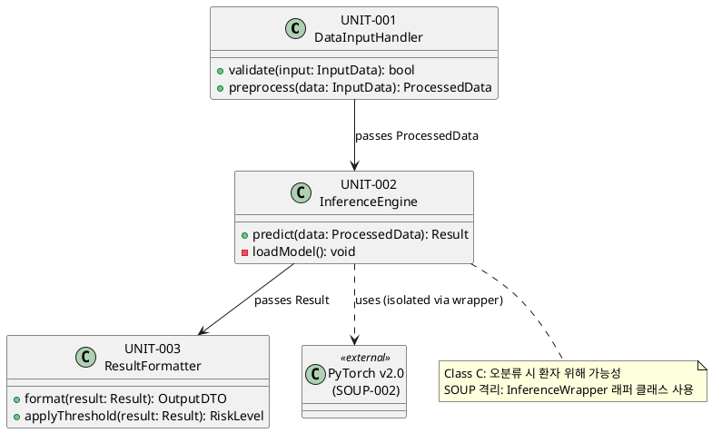
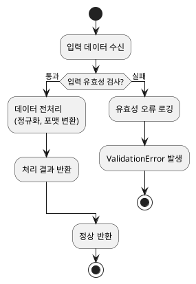
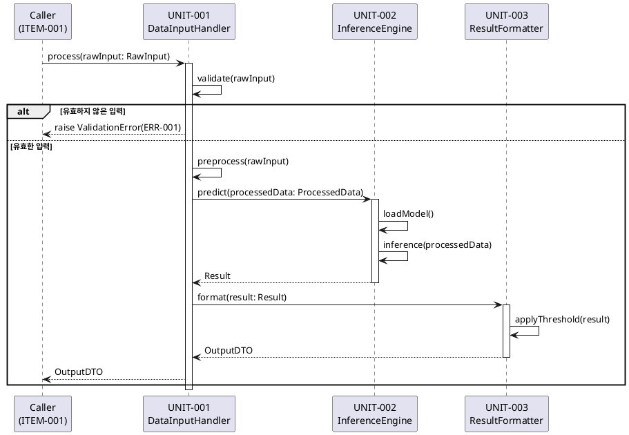

# Software Detailed Design (SDD): {PRODUCT_NAME}

<!-- AI AGENT 작성 지침
이 문서는 IEC 62304 Cl.5.4 기반 SW 상세 설계서 (Class B/C 필수)입니다.
작성 전 반드시 다음 문서를 참조하세요:
  - SAD(software-architecture-description.md): 아키텍처 및 아이템 구조 확인
  - SW 요구사항 명세서(software-requirements-list.md): 각 요구사항 ID 확인
  - FMEA(risk-table-fmea.md): 위험 통제 관련 설계 반영 여부 확인

작성 지침:
1. 유닛(Unit)별로 섹션 3.x를 반복 작성하세요
2. Class C의 경우 알고리즘, 분기 조건, 오류 처리를 상세히 기술해야 합니다
3. Class B의 경우 인터페이스 수준까지 기술합니다
4. 모든 유닛은 SRS 요구사항 ID와 추적 연결을 명시해야 합니다 (Cl.5.4.2)
5. SOUP 연동 유닛의 경우 격리 전략과 오류 처리를 반드시 기술하세요

PlantUML 다이어그램 작성 지침:
- 클래스 다이어그램: 유닛 간 의존성 표현 -> 섹션 2.2에 작성
- 활동 다이어그램: 유닛 처리 흐름 표현 -> 각 유닛 섹션(3.x)에 작성
- 시퀀스 다이어그램: 유닛 간 상호작용 표현 -> 섹션 4.1에 작성
- 상태 다이어그램: 상태 전이가 있는 유닛에 사용

PlantUML 블록 형식: ```plantuml ... ```
-->

**문서 번호**: {DOC_ID}
**버전**: {VERSION} | **상태**: Draft
**작성일**: {DATE} | **작성자**: {AUTHOR}
**검토자**: {REVIEWER} | **승인자**: {APPROVER}

---

## 표준 요건 매핑 (Standard Requirements Mapping)

| IEC 62304 조항 | 제목                      | 해당 섹션          | Class |
| -------------- | ------------------------- | ------------------ | ----- |
| Cl. 5.4.1      | SW 유닛 구현 및 검증 계획 | 1. 설계 개요       | B, C  |
| Cl. 5.4.2      | SW 유닛 검증              | 5. 유닛 검증 계획  | B, C  |
| Cl. 5.4.3      | SW 유닛 추가 상세 설계    | 3. 유닛 상세 설계  | C     |
| Cl. 5.3.2      | 아키텍처 인터페이스       | 4. 인터페이스 설계 | B, C  |
| Cl. 5.5.2      | 유닛 구현 검증            | 5. 유닛 검증 계획  | B, C  |
| ISO 14971 Cl.6 | 위험 통제 조치            | 6. 위험 관련 설계  | -     |

---

## 1. 설계 개요 (Design Overview)

### 1.1 목적 및 범위

이 문서는 {PRODUCT_NAME}의 {SW_ITEM_NAME} 아이템을 구성하는 SW 유닛의 상세 설계를 기술한다.

- **대상 SW 아이템**: {SW_ITEM_NAME} ({ITEM_ID})
- **IEC 62304 SW 안전 등급**: Class {IEC62304_CLASS}
- **참조 SAD 문서**: {SAD_DOC_ID}

### 1.2 포함 유닛 목록

<!-- AI AGENT: SAD에서 정의된 아이템 내 유닛 목록을 가져와 작성하세요 -->

| 유닛 ID  | 유닛 명       | 안전 등급     | 주요 기능         |
| -------- | ------------- | ------------- | ----------------- |
| UNIT-001 | {UNIT_1_NAME} | Class {CLASS} | {UNIT_1_FUNCTION} |
| UNIT-002 | {UNIT_2_NAME} | Class {CLASS} | {UNIT_2_FUNCTION} |

---

## 2. 유닛 구조 (Unit Structure)

### 2.1 유닛 분해 구조

```
{SW_ITEM_NAME} ({ITEM_ID})
  |-- {MODULE_1_NAME}
  |     |-- UNIT-001: {UNIT_1_NAME}
  |     |-- UNIT-002: {UNIT_2_NAME}
  |-- {MODULE_2_NAME}
        |-- UNIT-003: {UNIT_3_NAME}
```

### 2.2 유닛 의존성 다이어그램

<!-- AI AGENT: 유닛 간 의존 관계를 클래스 다이어그램 형태로 표현하세요
유닛이 다른 유닛의 함수를 호출하거나 인터페이스를 사용하는 경우 화살표로 표현합니다

지침:
- 각 유닛을 class로 표현
- 의존 방향을 -->  또는 ..> 으로 표현
- SOUP 의존성은 <<external>> 스테레오타입 사용

예시: -->



---

## 3. 유닛 상세 설계 (Unit Detailed Design)

> IEC 62304 Cl.5.4.3 (Class C 필수): 알고리즘, 데이터 구조, 처리 조건 상세 기술

---

### 3.1 {UNIT_1_NAME} (UNIT-001)

#### 3.1.1 목적 (Purpose)

<!-- AI AGENT: 이 유닛이 수행하는 단일 책임(Single Responsibility)을 한 문장으로 기술하세요 -->

{UNIT_1_PURPOSE}

#### 3.1.2 알고리즘 / 처리 흐름 (Algorithm / Processing Flow)

<!-- AI AGENT: 처리 로직을 활동 다이어그램으로 표현하고, 아래에 설명을 추가하세요
Class C: 분기 조건(if/else, try/except)을 모두 명시해야 합니다

예시: -->



**처리 단계 설명:**

1. **입력 검증**: {INPUT_VALIDATION_DESCRIPTION}
2. **전처리**: {PREPROCESSING_DESCRIPTION}
3. **핵심 처리**: {CORE_PROCESSING_DESCRIPTION}
4. **출력**: {OUTPUT_DESCRIPTION}

#### 3.1.3 데이터 구조 (Data Structures)

<!-- AI AGENT: 유닛이 처리하는 주요 입출력 데이터 구조를 정의하세요
범위 제한이 있는 필드는 반드시 허용 범위를 명시하세요 (안전 관련 값의 경우 필수) -->

**입력 (Input)**

| 필드명    | 타입   | 허용 범위 / 값 | 필수 여부 | 설명   |
| --------- | ------ | -------------- | --------- | ------ |
| {FIELD_1} | {TYPE} | {RANGE}        | 필수      | {DESC} |
| {FIELD_2} | {TYPE} | {RANGE}        | 선택      | {DESC} |

**출력 (Output)**

| 필드명           | 타입   | 범위    | 설명   |
| ---------------- | ------ | ------- | ------ |
| {OUTPUT_FIELD_1} | {TYPE} | {RANGE} | {DESC} |

#### 3.1.4 오류 처리 (Error Handling)

<!-- AI AGENT: 가능한 모든 오류 조건과 처리 방법을 기술하세요
IEC 62304 Cl.5.4.3: 안전 관련 오류는 반드시 Fail-Safe 동작을 정의해야 합니다 -->

| 오류 조건         | 오류 코드 | 처리 동작                | Fail-Safe 여부 | 로그 레벨    |
| ----------------- | --------- | ------------------------ | -------------- | ------------ |
| {ERROR_1}         | ERR-{N}   | {ACTION}                 | Yes / No       | ERROR / WARN |
| 입력 값 범위 초과 | ERR-001   | 처리 중단 후 기본값 반환 | Yes            | ERROR        |

#### 3.1.5 요구사항 추적 (Requirements Traceability)

| SRS 요구사항 ID | 요구사항 설명 | 구현 방법     |
| --------------- | ------------- | ------------- |
| {SRS_ID_1}      | {REQ_DESC}    | {IMPL_METHOD} |

---

### 3.2 {UNIT_2_NAME} (UNIT-002)

<!-- AI AGENT: 3.1 양식을 반복하여 각 유닛을 기술하세요 -->

---

## 4. 인터페이스 설계 (Interface Design)

> IEC 62304 Cl.5.3.2 아키텍처 인터페이스, Cl.5.4.3 상세 인터페이스

### 4.1 유닛 간 인터페이스 시퀀스

<!-- AI AGENT: 유닛 간 주요 상호작용을 시퀀스 다이어그램으로 표현하세요
요청-응답 사이의 데이터 타입과 오류 분기를 포함하세요

예시: -->



### 4.2 SOUP 연동 인터페이스

> IEC 62304 Cl.5.3.5 (SOUP 격리)

| SOUP ID  | SOUP 명     | 연동 방식        | 래퍼 클래스     | 고장 시 동작       |
| -------- | ----------- | ---------------- | --------------- | ------------------ |
| SOUP-001 | {SOUP_NAME} | {INTERFACE_TYPE} | {WRAPPER_CLASS} | {FAILURE_BEHAVIOR} |

---

## 5. 유닛 검증 계획 (Unit Verification Plan)

> IEC 62304 Cl.5.4.2, Cl.5.5.2 (유닛 검증 방법 및 합격 기준)

### 5.1 검증 방법

| 방법           | 설명                          | 적용 유닛          | 담당자     |
| -------------- | ----------------------------- | ------------------ | ---------- |
| 코드 리뷰      | 정적 분석 및 피어 리뷰        | 전체               | {REVIEWER} |
| 유닛 테스트    | pytest / unittest 기반 자동화 | UNIT-001, UNIT-002 | {DEV}      |
| 정적 분석 도구 | {STATIC_ANALYSIS_TOOL}        | 전체               | CI/CD      |

### 5.2 합격 기준 (Acceptance Criteria)

<!-- AI AGENT: SW 안전 등급에 따른 커버리지 기준을 적용하세요
Class A: 요구사항 기반 테스트 / Class B: Statement 커버리지 / Class C: Branch 커버리지 -->

| 유닛 ID            | 커버리지 기준      | 최소 기준값 | 허용 정적 분석 경고  |
| ------------------ | ------------------ | ----------- | -------------------- |
| UNIT-001 (Class B) | Statement Coverage | >= 80%      | 0건 (정당화 시 허용) |
| UNIT-002 (Class C) | Branch Coverage    | 100%        | 0건                  |

---

## 6. 위험 관련 설계 고려사항 (Risk-Related Design Considerations)

> ISO 14971 Cl.6 (위험 통제 조치), IEC 62304 Cl.7.1

<!-- AI AGENT: FMEA(risk-table-fmea.md)의 Risk Control Measures를
이 섹션에서 어떻게 구현하는지 연결하세요 -->

| 위험 ID     | 위험 설명   | 설계 통제 방법   | 구현 유닛 | 검증 방법      |
| ----------- | ----------- | ---------------- | --------- | -------------- |
| {RISK_ID_1} | {RISK_DESC} | {DESIGN_CONTROL} | UNIT-{N}  | {VERIFICATION} |

---

## 7. 추적성 매트릭스 요약 (Traceability Summary)

> IEC 62304 Cl.5.1.1(c), Cl.5.7.4

| SRS 요구사항 ID | 유닛 ID  | 유닛 테스트 ID | 위험 ID   |
| --------------- | -------- | -------------- | --------- |
| {SRS_ID_1}      | UNIT-001 | TEST-{N}       | {RISK_ID} |
| {SRS_ID_2}      | UNIT-002 | TEST-{N}       | -         |

---

## 8. 변경 이력 (Revision History)

| 버전 | 날짜   | 작성자   | 변경 내용 |
| ---- | ------ | -------- | --------- |
| 0.1  | {DATE} | {AUTHOR} | 초안 작성 |

---

> Template based on IEC 62304:2006/AMD1:2015 Cl.5.4, ISO 14971:2019
